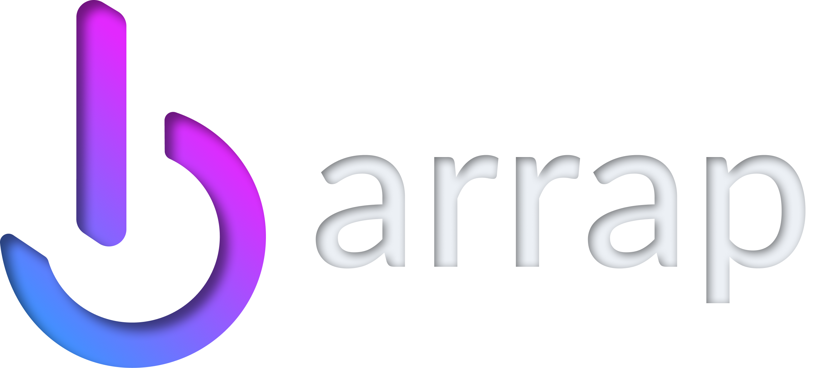

<a id="readme-top"></a>

<br />
<div align="center">
  <a href="https://www.barra.mx">
    
  </a>

  <h3 align="center">Barrap Landing</h3>

  <p align="center">
    Donde la Comunidad se Une para la Acción
    <br />
    <a href="https://www.barra.mx"><strong>View Demo »</strong></a>
  </p>
</div>

<!-- TABLE OF CONTENTS -->
<details>
  <summary>Table of Contents</summary>
  <ol>
    <li>
      <a href="#about-the-project">About The Project</a>
      <ul>
        <li><a href="#built-with">Built With</a></li>
      </ul>
    </li>
    <li>
      <a href="#getting-started">Getting Started</a>
      <ul>
        <li><a href="#prerequisites">Prerequisites</a></li>
        <li><a href="#installation">Installation</a></li>
      </ul>
    </li>
    <li><a href="#roadmap">Roadmap</a></li>
    <li><a href="#license">License</a></li>
    <li><a href="#contact">Contact</a></li>
  </ol>
</details>

<!-- ABOUT THE PROJECT -->
## About The Project

[![Product Name Screen Shot][product-screenshot]](https://www.barra.mx)

Barrap es la red social que te conecta con personas y recursos para superar desafíos. Únete a una comunidad de acción, invierte en proyectos y transforma la colaboración en un impacto real y medible.

Nuestra propuesta de valor es simple: liderazgo colectivo para conexiones significativas y un impacto real.

<p align="right">(<a href="#readme-top">back to top</a>)</p>

### Built With

This project is built with a modern, robust tech stack:

* [![Next][Next.js]][Next-url]
* [![React][React.js]][React-url]
* [![Tailwind CSS][Tailwind-css]][Tailwind-url]
* [![ShadCN UI][Shadcn-ui]][Shadcn-url]
* [![Genkit][Genkit-shield]][Genkit-url]
* [![Solana][Solana-shield]][Solana-url]


<p align="right">(<a href="#readme-top">back to top</a>)</p>

<!-- GETTING STARTED -->
## Getting Started

To get a local copy up and running, follow these simple steps.

### Prerequisites

Make sure you have npm installed.
* npm
  ```sh
  npm install npm@latest -g
  ```

### Installation

1. Clone the repo
   ```sh
   git clone https://github.com/milktechio/barrap.git
   ```
2. Install NPM packages
   ```sh
   npm install
   ```
3. Run the development server
   ```sh
   npm run dev
   ```
   Open [http://localhost:9002](http://localhost:9002) with your browser to see the result.

<p align="right">(<a href="#readme-top">back to top</a>)</p>

<!-- ROADMAP -->
## Roadmap

- [x] Integración con Solana
- [x] Integración con Binance
- [x] 200+ Primeros Usuarios
- [x] 1 Iniciativa Desplegada
- [ ] Socios Estratégicos
- [ ] Lanzamiento Completo de 4 iniciativas
- [ ] Crecimiento y Expansión
- [ ] Mejora continua de la app

<p align="right">(<a href="#readme-top">back to top</a>)</p>

<!-- LICENSE -->
## License

Distributed under the MIT License.

<p align="right">(<a href="#readme-top">back to top</a>)</p>

<!-- CONTACT -->
## Contact

Creadores:
* **milktechio**
* **alfredocendejas**

Project Link: [https://github.com/milktechio/barrap/](https://github.com/milktechio/barrap/)

<p align="right">(<a href="#readme-top">back to top</a>)</p>

<!-- MARKDOWN LINKS & IMAGES -->
[product-screenshot]: public/images/redsocial.png
[Next.js]: https://img.shields.io/badge/next.js-000000?style=for-the-badge&logo=nextdotjs&logoColor=white
[Next-url]: https://nextjs.org/
[React.js]: https://img.shields.io/badge/React-20232A?style=for-the-badge&logo=react&logoColor=61DAFB
[React-url]: https://reactjs.org/
[Tailwind-css]: https://img.shields.io/badge/Tailwind_CSS-38B2AC?style=for-the-badge&logo=tailwind-css&logoColor=white
[Tailwind-url]: https://tailwindcss.com/
[Shadcn-ui]: https://img.shields.io/badge/shadcn/ui-000000?style=for-the-badge&logo=shadcn-ui&logoColor=white
[Shadcn-url]: https://ui.shadcn.com/
[Genkit-shield]: https://img.shields.io/badge/Genkit-4285F4?style=for-the-badge&logo=google&logoColor=white
[Genkit-url]: https://firebase.google.com/docs/genkit
[Solana-shield]: https://img.shields.io/badge/Solana-9945FF?style=for-the-badge&logo=solana&logoColor=white
[Solana-url]: https://solana.com/
